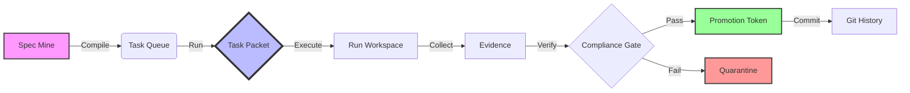

<div align="center">

# ⚡ TaskX
### The "No-Nonsense" Deterministic Task Engine

[](https://github.com/OWNER/REPO/actions)
[](https://python.org)
[](https://opensource.org/licenses/MIT)
[](https://github.com/astral-sh/ruff)
[](https://mypy-lang.org/)

**Offline-First • Deterministic • Auditable • Operator-Grade**

[Installation](docs/INSTALL.md) • [Release Guidelines](docs/RELEASE.md) • [Contributing](AGENTS.md)

</div>

---

## 🦾 What is TaskX?

Imagine a task runner that doesn't trust the internet, doesn't trust your system clock, and definitely doesn't trust random file mutations. That's **TaskX**.

TaskX is a rigorous system for managing the lifecycle of **"Task Packets"**—self-contained units of work. It is built for environments where "it works on my machine" is considered an admission of guilt.

### 🌟 Why You'll Love It (Or Fear It)

- **🔮 Deterministic Time Travel**: We mock time. Literal time. Your builds will produce the exact same artifacts today, tomorrow, and in 2050.
- **🛡️ The Great Allowlist**: Files don't just "change." They apply for a visa. Our `AllowlistDiff` system catches unauthorized mutations before they even think about becoming a commit.
- **🔌 Offline by Design**: TaskX assumes the internet is down. If your build needs `npm install` to run, go back to square one.
- **🧬 Audit Trails**: Every run produces a forensic verification trail. Who ran it? When? with what inputs? It's all in the JSON.

---

## 🔄 The Lifecycle

TaskX treats code changes as a manufacturing pipeline.



1.  **Compile**: Task definitions are mined from your specs and compiled into immutable packets.
2.  **Run**: A packet is executed in an isolated workspace.
3.  **Gate**: The output is scanned. Did it touch a file it wasn't supposed to? **REJECTED.**
4.  **Promote**: Only if the gate passes do you get a `PROMOTION.json` token.
5.  **Commit**: You cannot commit without a token. (We check.)

---

## Deterministic Task Execution

TaskX uses isolated git worktrees and commit plans to ensure:

- linear `main` history
- one packet = one commit stack
- deterministic rebases and fast-forward merges
- zero accidental commits on `main`

See `docs/WORKTREES_COMMIT_SEQUENCING.md` for details.
If a packet includes a `COMMIT PLAN`, execute it with `taskx commit-sequence`; manual commits can break determinism guarantees. See `docs/TASK_PACKET_FORMAT.md`.

---

## 🚀 Quick Start

Get up and running faster than you can say "idempotency."

### 1. Installation

The easiest way to join the cult—err, project—is via the installer script:

```bash
# Latest stable version
curl -fsSL https://raw.githubusercontent.com/hu3mann/taskX/main/scripts/install.sh | bash
```

*Need manual installation or wheel support? Check the [Detailed Installation Guide](docs/INSTALL.md).*

### 2. The "Hello World" Loop

Let's run a loop. A loop creates tasks, runs them, checks them, and promotes them.

```bash
# 1. Compile some tasks (MVP mode)
taskx compile-tasks --mode mvp --max-packets 5

# 2. Pick a task ID from the output (e.g., T001) and run it
taskx run-task --task-id T001

# 3. Check if you passed the gate
taskx gate-allowlist --run ./out/runs/RUN_..._T001

# 4. If you see green, promote it!
taskx promote-run --run ./out/runs/RUN_..._T001
```

### 3. The Doctor Is In

Something feels off? The doctor knows all.

```bash
taskx doctor
```

This runs a full diagnostic of your environment, checking dependencies, schema integrity, and even if your system clock is behaving (though we won't trust it anyway).

---

## 🧰 The Toolkit

TaskX is a CLI composed of sharp, single-purpose tools.

| Command | Description |
| :--- | :--- |
| `compile-tasks` | Mines specs and fills the task queue. |
| `run-task` | Hydrates a workspace and executes a packet. |
| `collect-evidence` | Scrapes the run for claims and facts. |
| `gate-allowlist` | The bouncer. Checks `diff` vs `allowlist`. |
| `promote-run` | Mints a crypto-token of approval. |
| `commit-run` | Stages files (and ONLY verified files). |
| `doctor` | Self-diagnostic health check. |

---

## 🧩 Dopemux Integration

TaskX plays nicely with **Dopemux**, our state-of-the-art service multiplexer.

If you are in a Dopemux environment, use the `dopemux` namespace for auto-discovery of paths:

```bash
taskx dopemux compile
taskx dopemux run --task-id T002
taskx dopemux gate
```

It's like magic, but deterministic.

---

## � The Golden Rules

1.  **Thou Shalt Not Touch Unlisted Files**: If it's not in the allowlist, it doesn't exist.
2.  **Thou Shalt Not Trust `datetime.now()`**: Use `timestamp_mode="deterministic"` for release builds.
3.  **Thou Shalt Commit Only Promoted Runs**: No token, no commit.

---

## 🏗 Contributing

We are strict but fair.

- **Linting**: We use `ruff`.
- **Typing**: We use `mypy --strict`.
- **Tests**: We use `pytest` and require 100% pass rate.

See [AGENTS.md](AGENTS.md) for the AI agent protocol.

---

<div align="center">

**[Report Bug](https://github.com/OWNER/REPO/issues)** • **[Request Feature](https://github.com/OWNER/REPO/issues)**

<sub>Built with ☕ and paranoid rigor by the Dopemux contributors.</sub>

</div>
