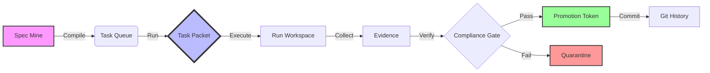

# TaskX is a deterministic task-packet execution kernel that plans one path or refuses with evidence.

## Guarantees

- Artifact-first: if it did not write an artifact, it did not happen.
- Refusal-first: invalid or unsafe inputs produce a structured refusal with a stable exit code.
- Deterministic: identical packet + declared inputs + TaskX version yields identical outputs.
- Single-path: no hidden retries, no fallback runners, no background execution.

## Install

[Installation](docs/INSTALL.md) • [Release Guidelines](docs/RELEASE.md) • [Contributing](AGENTS.md)

</div>

---

## 🦾 What is TaskX?

Imagine a task runner that doesn't trust the internet, doesn't trust your system clock, and definitely doesn't trust random file mutations. That's **TaskX**.

TaskX is a rigorous system for managing the lifecycle of **"Task Packets"**—self-contained units of work. It is built for environments where "it works on my machine" is considered an admission of guilt.

### 🌟 Why You'll Love It (Or Fear It)

- **🔮 Deterministic Time Travel**: We mock time. Literal time. Your builds will produce the exact same artifacts today, tomorrow, and in 2050.
- **🛡️ The Great Allowlist**: Files don't just "change." They apply for a visa. Our `AllowlistDiff` system catches unauthorized mutations before they even think about becoming a commit.
- **🔌 Offline by Design**: TaskX assumes the internet is down. If your build needs `npm install` to run, go back to square one.
- **🧬 Audit Trails**: Every run produces a forensic verification trail. Who ran it? When? with what inputs? It's all in the JSON.

---

## 🔄 The Lifecycle

TaskX treats code changes as a manufacturing pipeline.



1.  **Compile**: Task definitions are mined from your specs and compiled into immutable packets.
2.  **Run**: A packet is executed in an isolated workspace.
3.  **Gate**: The output is scanned. Did it touch a file it wasn't supposed to? **REJECTED.**
4.  **Promote**: Only if the gate passes do you get a `PROMOTION.json` token.
5.  **Commit**: You cannot commit without a token. (We check.)

---

## Deterministic Task Execution

TaskX uses isolated git worktrees and commit plans to ensure:

- linear `main` history
- one packet = one commit stack
- deterministic rebases and fast-forward merges
- zero accidental commits on `main`

See `docs/WORKTREES_COMMIT_SEQUENCING.md` for details.
If a packet includes a `COMMIT PLAN`, execute it with `taskx commit-sequence`; manual commits can break determinism guarantees. See `docs/TASK_PACKET_FORMAT.md`.

---

## 🚀 Quick Start

Get up and running faster than you can say "idempotency."

### 1. Installation

The easiest way to join the cult—err, project—is via the installer script:

```bash
# Latest stable version
curl -fsSL https://raw.githubusercontent.com/hu3mann/taskX/main/scripts/install.sh | bash
```

*Need manual installation or wheel support? Check the [Detailed Installation Guide](docs/INSTALL.md).*

### 2. The "Hello World" Loop

Let's run a loop. A loop creates tasks, runs them, checks them, and promotes them.

```bash
python -m pip install taskx
taskx --help
```

See `docs/01_INSTALL.md` for developer workflows and testing.

## 60-second example

```bash
taskx route init --repo-root .
cat > PACKET.md <<'EOF'
# Packet
ROUTER_HINTS:
  risk: low
EOF
taskx route plan --repo-root . --packet PACKET.md
ls -1 out/taskx_route/
```

Expected outputs:

- `out/taskx_route/ROUTE_PLAN.json`
- `out/taskx_route/ROUTE_PLAN.md`
- `out/taskx_route/HANDOFF.md` (for handoff flows)

## Documentation Map

Canonical spine:

1. `docs/00_OVERVIEW.md`
2. `docs/10_ARCHITECTURE.md`
3. `docs/11_PUBLIC_CONTRACT.md`
4. `docs/12_ROUTER.md`
5. `docs/14_PROJECT_DOCTOR.md`
6. `docs/90_RELEASE.md`

Extended references:

- Install: `docs/01_INSTALL.md`
- Quickstart: `docs/02_QUICKSTART.md`
- Task packet format: `docs/13_TASK_PACKET_FORMAT.md`
- Worktrees and commit sequencing (maintainers): `docs/20_WORKTREES_COMMIT_SEQUENCING.md`
- Case bundles (maintainers): `docs/21_CASE_BUNDLES.md`
- Release (maintainers): `docs/90_RELEASE.md`
- Security policy: `SECURITY.md`
- Contributing guide: `CONTRIBUTING.md`

## Kernel vs ecosystem

TaskX (kernel) validates packets, plans deterministically, executes one path (or emits a manual handoff), and writes canonical artifacts.

Everything else (scheduling, orchestration, memory, UX) belongs in the ecosystem above the kernel.

## Badge wall

- Deterministic: VERBATIM_REQUIRED
- Implicit Retries: VERBATIM_REQUIRED
- Silent Fallbacks: VERBATIM_REQUIRED
- Cross-Run State: VERBATIM_REQUIRED
- Multi-Runner: VERBATIM_REQUIRED
- Ghost Behavior: VERBATIM_REQUIRED

## Kernel Manifesto

VERBATIM_REQUIRED

## Anti-Features

TaskX will never:
- retry silently
- fallback to a different runner
- execute multiple paths
- persist state across runs
- perform undeclared network calls
- "do what you meant"
- reorder declared steps
- mutate your repository implicitly

If you want flexibility, build it above the kernel.

## Kernel FAQ

VERBATIM_REQUIRED

## Determinism Stress Test

Given identical:
- packet
- declared environment inputs
- TaskX version

You must observe identical:
- route plans
- artifacts
- exit codes
- hashes

If any of those change without a version bump:
the contract has been violated.

## Why TaskX Is Hot

VERBATIM_REQUIRED
